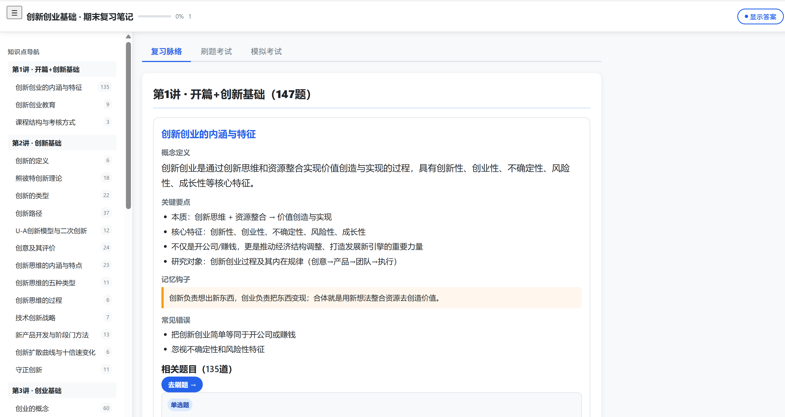
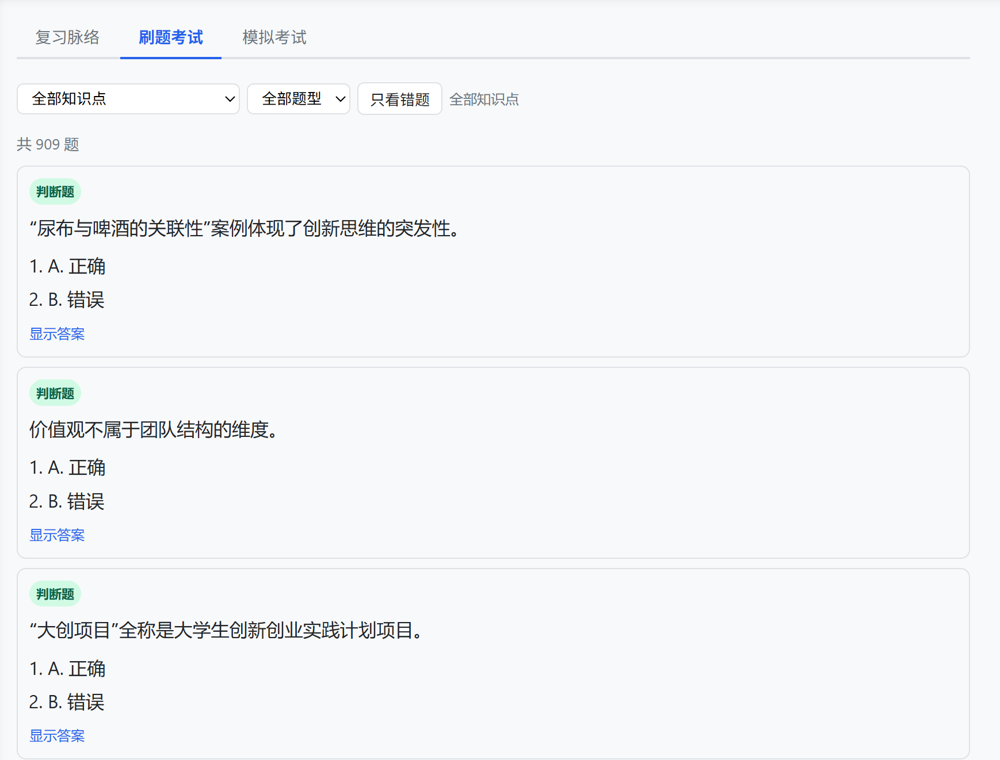
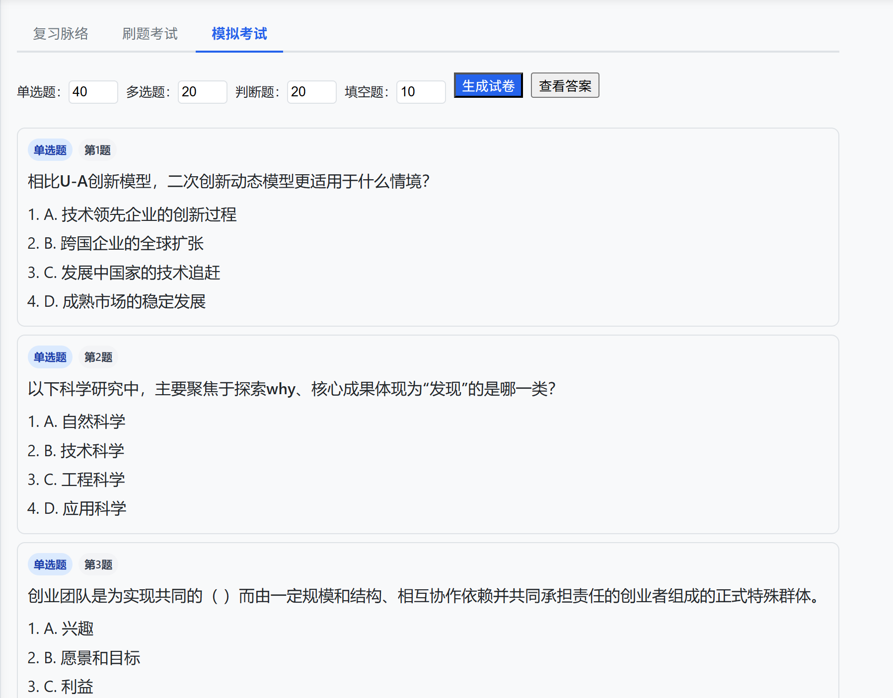

# PaperAlchemy — 课件炼金术

> 课件 + 题库 → HTML 复习页面。没课件？仅凭教材名 + 题库也能用。

[](LICENSE)
[]()
[]()

## 功能预览

生成的 HTML 页面包含三个 tab：

| 复习脉络 | 刷题考试 | 模拟考试 |
|----------|---------|----------|
| 知识点卡片 + 记忆钩子 | 全部题目按需加载 | 随机抽题考试 |
| 每知识点 Top-6 例题 | 按知识点/题型筛选 | 可选题型和数量 |
| 「去刷题」一键跳转 | 「只会/不会」标记 | 对照答案 |
| 进度条实时百分比 | 「只看错题」模式 | → 回刷题 tab 标记错题 |
| 简答题专区 | **标记可撤销** | |





 |

### 一句话说清

把老师给的 PPT 和你找到的题库网站整合成一个文件，电脑手机都能看。左边是知识点笔记，中间可以刷全部题目＋标记错题，右边能随机生成模拟考卷。**关了再打开错题还在**（存在浏览器本地）。

## 安装

### 方式 1：克隆到 skills 目录（推荐）

```bash
# Claude Code / OpenClaw
git clone https://github.com/helloworld-dlx/PaperAlchemy.git ~/.claude/skills/PaperAlchemy/

# OpenCode
git clone https://github.com/helloworld-dlx/PaperAlchemy.git ~/.config/opencode/skills/PaperAlchemy/

# Codex
git clone https://github.com/helloworld-dlx/PaperAlchemy.git ~/.codex/skills/PaperAlchemy/
```

### 方式 2：一键安装

```bash
# 使用 skills CLI（如果已安装）
npx skills add user/PaperAlchemy
```

### 支持的所有 Agent

| Agent | 安装路径 |
|-------|---------|
| OpenCode | `~/.config/opencode/skills/PaperAlchemy/` |
| Claude Code | `~/.claude/skills/PaperAlchemy/` |
| Codex CLI | `~/.codex/skills/PaperAlchemy/` |
| OpenClaw | `~/.claude/skills/PaperAlchemy/` |
| Gemini CLI | `~/.gemini/skills/PaperAlchemy/` |
| Copilot CLI | 项目 `.github/copilot-skills/` |

## 快速开始

安装后在 Agent 中触发：

```
帮我期末复习，课件在 D:\我的课件\，题库在 https://xxx.github.io/quiz/
```

Agent 会自动：
1. 解析课件（PDF/DOCX/PPT）
2. 爬取题库
3. 提取知识点
4. 匹配题目到知识点
5. 生成 `期末复习笔记.html`（一个文件，直接打开）

## 配置

在 `template/page_template.py` 中可调整：

```python
DEFAULT_SHOW = 6     # 知识点默认展示几道题
USE_KATEX = False    # 理工科启用公式渲染
```

## 适用场景

| ✅ 适合 | ❌ 不适合 |
|---------|----------|
| 考前 3-14 天冲刺复习 | 30 天以上长期学习（用 ko-lesson） |
| 有题库需要大量刷题 | 需要打印精美笔记（用 NovaForge） |
| 手机/电脑都能复习 | 纯实验/实践课 |
| 文科/经管/思政/理工科 | |

## 与同类工具对比

| | PaperAlchemy | ko-lesson | NovaForge | zero-to-pass |
|---|---|---|---|---|
| 题库支持 | ✅ 真实题库匹配 | ❌ 自己出题 | ❌ | ✅ 试卷文件 |
| 错题追踪 | ✅ localStorage 持久化 | 学习状态文件 | ❌ | ❌ |
| 输出形式 | 自包含 HTML | Obsidian md | LaTeX/PDF | Markdown |
| 移动端 | ✅ | 需 Obsidian app | PDF 可看 | 勉强 |
| 体积 | ~220KB | 多个文件 | PDF 适中 | 按需 |

## 文件结构

```
.
├── SKILL.md                 # Skill 定义（Agent 加载入口）
├── README.md                # 本文件
├── template/
│   └── page_template.py     # HTML 生成模板（CSS+JS+Python）
└── references/
    ├── knowledge_card_format.md
    └── keyword_matching.md
```

## FAQ

**Q: 生成的 HTML 能在手机上打开吗？**

A: 可以。微信发给自己直接打开，或用文件管理器 + 浏览器。

**Q: 错题记录存储在哪里？**

A: 浏览器的 localStorage。不清除浏览器数据就不会丢。

**Q: 理工科公式怎么办？**

A: 模板设置 `USE_KATEX=True`，自动支持 `$...$` 和 `$$...$$` 公式渲染。

**Q: 生成的页面 220KB，是不是漏了题目？**

A: 没有。909 道题以紧凑 JSON 存储在 JS 变量里，打开页面后动态渲染。体积比 HTML 预渲染小 77%。

## 贡献

欢迎提 Issue 和 PR。适合的贡献方向：

- 新功能建议（如 PDF 导出、计时考试）
- HTML 样式和交互优化
- 其他 Agent 的适配测试
- 文档改进

## License

MIT
